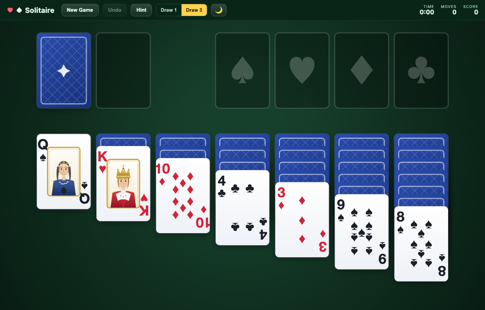
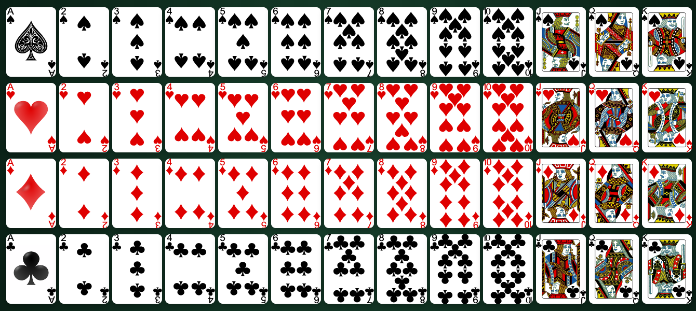
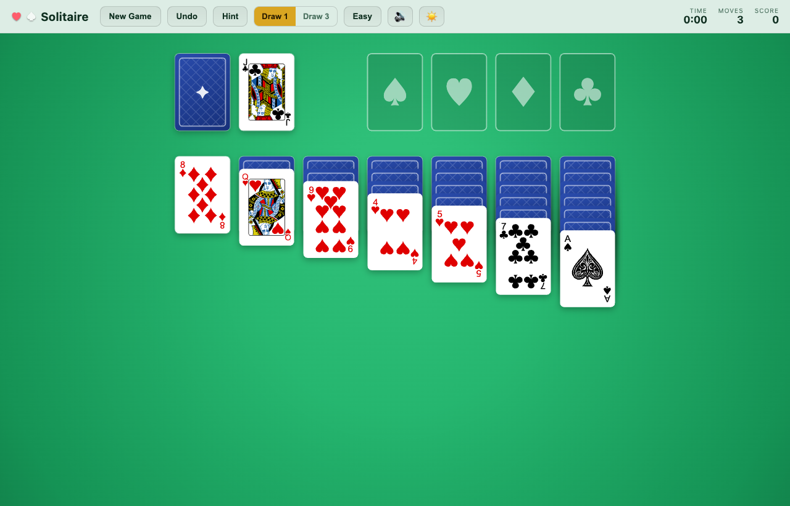
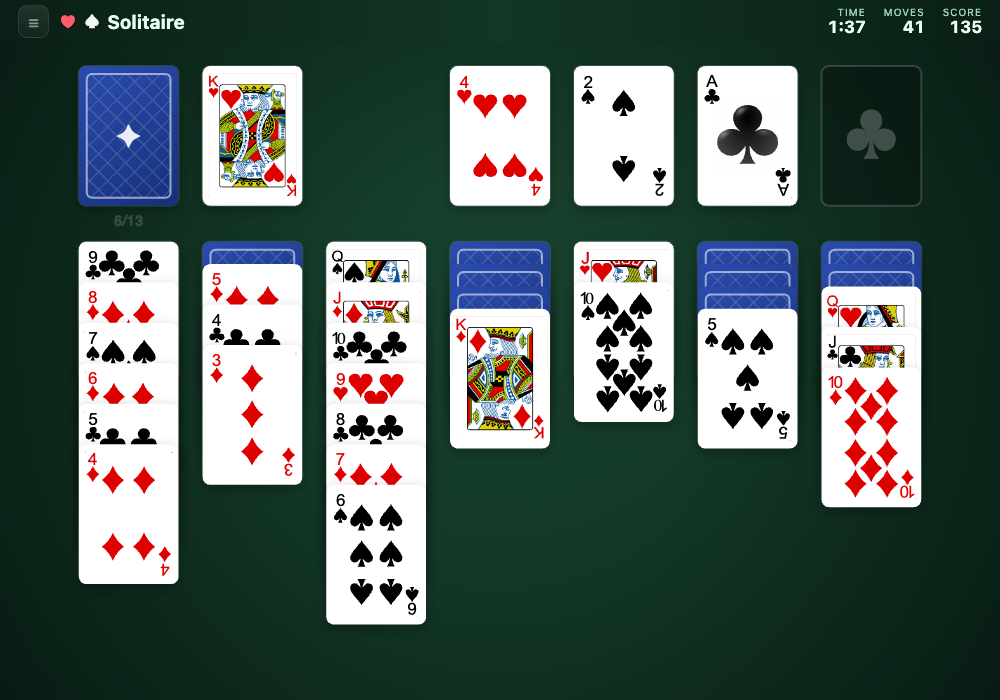
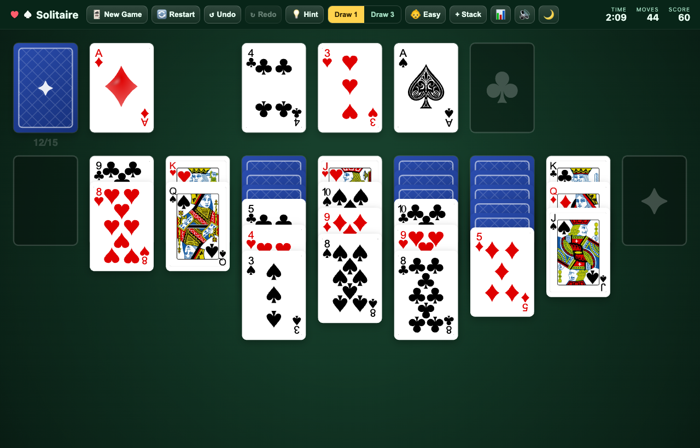
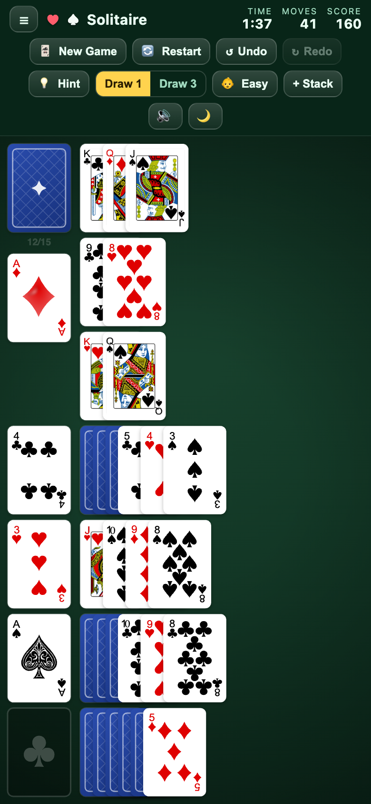
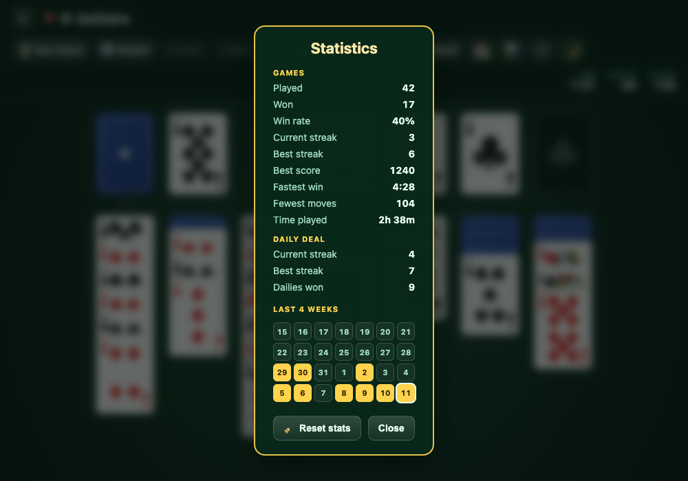
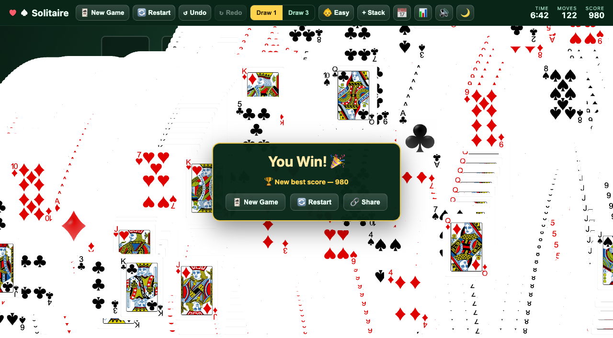

# Solitaire

### ▶️ [**Play now → solitaire.ruchij.com**](https://solitaire.ruchij.com)

A polished, high-quality **Klondike Solitaire** built with **TypeScript** and the
**HTML5 Canvas**. Cards are crisp **SVG** faces (the public-domain
*vector-playing-cards* set) drawn onto procedurally-rendered, rounded, shadowed
card bodies, so the game stays razor-sharp at any resolution or pixel density,
with smooth, physics-flavoured animations throughout. Zero runtime dependencies.



---

## Highlights

- 🎴 **Classic SVG card faces** — all 52 cards use the public-domain
  *vector-playing-cards* set (detailed court figures, clean pips), drawn on
  rounded, shadowed card bodies. Crisp at any size; a procedural face is used as
  a fallback while the SVGs decode.
- ✨ **Crisp Canvas rendering** — rounded cards with soft drop shadows, patterned
  card backs, and a felt-green gradient table with a subtle vignette. Everything
  is vector and DPI-aware.
- 🎞️ **Fluid animations** — staggered opening deal, card flips, fly-to-pile
  moves, lift-and-drop drag feedback, animated snap-back on illegal moves,
  auto-complete sweep, and a classic bouncing-card **win celebration**.
- 🃏 **Full Klondike rules** — Draw 1 / Draw 3 toggle, multi-card run dragging,
  waste recycling, undo/redo history, move counter and timer, and scoring
  that charges a point per move so a tidy win beats a long one.
- 📅 **Daily deal** — one board a day, the same one for everybody, derived from the
  date itself. Win it on consecutive days to build a **daily streak**; miss a day and
  the run starts over. The **📅** button (or `D`) deals it and shows whether today's
  is unplayed, under way, or already won.
- 🔗 **Share your result** — winning offers a **Share** button that copies your
  score, time, moves and daily streak, with a link to the exact deal, ready to paste
  into a chat.
- 🏆 **Lifetime statistics** — games played, games won, win rate, current and best
  streak, best score, fastest win, fewest moves, total time played, and your daily
  streak, all kept in `localStorage`. The win dialog calls out a new best score, and
  the stats can be reset whenever you want a clean slate.
- 🆘 **Easy mode & temp stacks** — toggle a friendlier ruleset where empty
  columns accept any card (not just Kings), and buy up to three temporary
  ✦ **parking stacks** (50 points each) to break a stalemate.
- 🎨 **Four table themes** — Midnight, Bright, Claret and Parchment. Each restyles
  the felt, the chrome *and the card backs*, and the toolbar button cycles through
  them; your choice is remembered.
- 🙈 **Hideable toolbar** — when the window is too narrow to fit the buttons and
  the stats on one row, a **☰** button (or `T`) folds the buttons away and gives
  the height to the board; the clock, moves and score stay on screen. Wide
  enough to fit, and the toggle isn't there at all. Remembered.
- 🔁 **Seeded deals** — every game has a short **deal code**, kept in the address
  bar (`?deal=ABC123`) rather than on the table. **Restart** replays the same
  layout from scratch, and copying the URL lets someone else play the identical
  game.
- 💾 **Resumes where you left off** — the game in progress is saved to
  `localStorage`, so closing the tab or refreshing brings back the same board,
  score, moves and clock. The opening screen offers **Resume game**, or a fresh
  deal if you'd rather start over. (Undo history isn't kept across a reload.)
- 🖱️ **Mouse & touch** — drag-and-drop, click-to-draw, and double-click /
  double-tap to auto-send a card to its foundation. While you drag, the pile
  you'd land on lights up, the cursor shows what's grabbable, and `Esc` puts
  the cards back.
- ⌨️ **Playable without a mouse** — arrow keys move a cursor around the board,
  `Space` picks up and drops, `Shift` + `↑`/`↓` takes more or fewer cards, and `F`
  sends a card home. Every move is announced to screen readers through a live region,
  so the game is playable without seeing it. The cursor only appears once you use the
  keyboard, and goes away the moment you touch the mouse.
- 🔍 **Is this still winnable?** — a solver searches the position and tells you
  whether a win is still reachable, so a hopeless deal doesn't waste your evening. It
  runs off the main thread, and says "couldn't tell" rather than guessing when the
  search runs long.
- 📲 **Installable & offline** — a web manifest and a service worker cache the whole
  game (~1.5 MB, all 52 card faces included), so it installs to a phone home screen
  and plays on a plane. Page loads go to the network first, so a new version is never
  masked by the cache.
- 🔋 **Idles properly** — the canvas is repainted only when something actually
  changes, so a board you're staring at while you think costs nothing rather than
  redrawing itself a hundred times a second.
- 📐 **Responsive** — the board re-lays out to fit any window size. Cards are
  sized to fill the table, with room for an ordinary column to fan; deeper
  columns overlap tighter instead of shrinking every card. Phone-portrait
  screens get a dedicated vertical layout where the piles are listed
  top-to-bottom and cards fan sideways.

## Card art

The 52 card faces are the public-domain
[*vector-playing-cards*](http://code.google.com/p/vector-playing-cards/) SVG set
(`public/cards/`), each drawn onto a rounded, shadowed card body rendered on the
canvas:



## Themes

The toolbar button cycles through four tables — **Midnight**, **Bright**, **Claret**
and **Parchment** — and says which one is next. The felt, vignette, pile outlines,
toolbar *and the card backs* all change together; the backs matter most, since the
felt spends the game mostly covered by cards.

Your choice is saved to `localStorage`, and any theme can be deep-linked:
`?theme=dark` (Midnight), `?theme=light` (Bright), `?theme=claret`,
`?theme=parchment`. The first two keep their original names so links and saved
preferences from before the other themes existed still work. An unrecognised name
falls back to Midnight rather than failing.



## Hideable toolbar

Narrow windows can't fit the buttons and the stats on one row, and that's exactly
when the board can least afford the height — so a **☰** button appears (keyboard:
`T`) that folds the buttons away and hands the space to the cards. The clock,
moves and score stay put on a strip painted to match the felt, and the board
re-lays out into whatever it gains. Wide enough for one row, and there's no
toggle at all — there'd be nothing to fold. Your choice is remembered.



## Easy mode & temporary stacks

Two independent assists live in the toolbar:

- **Easy** toggles a friendlier ruleset where **empty columns accept any
  card**, not just Kings. It applies to the game you're playing rather than
  sticking as a preference — every new game starts with it off. (Resuming a
  saved game keeps whatever setting that game was played under.)
- **+ Stack** buys a temporary **✦ parking pile** for **50 points**, added as
  an extra column on the right of the board (or an extra row on phones). Drag
  any card or run onto it to park it — the card underneath is revealed and
  play can continue. Up to three stacks can exist at once; parking on one
  you've bought is free, and a stack **vanishes once you empty it** (freeing a
  slot for another). Buying a stack is undoable like any move.



## Phone layout

On phone-sized portrait screens the board transposes to fit the tall, narrow
viewport — it's the landscape board rotated. Stock, waste and the four
foundations run down a **rail** on the left, where landscape puts them in a top
row, and the seven tableau piles become rows beside it that fan rightward. The
rows own the full height rather than sitting under a header, which is what keeps
the cards large and easy to tap instead of squeezing seven columns side-by-side.
Rotating the phone switches back to the classic column layout.



## The daily deal

The **📅** button (or `D`) deals **today's board** — the same one for every player,
worked out from the date alone, so a score on it is worth comparing. It's an ordinary
seeded deal underneath: **Restart** replays it, and its `?deal=` URL shares like any
other.

Past deals are playable too: the **📊 Statistics** dialog shows the last four weeks as
a grid, filled in for the days you've won and ringed on today. Click any day to play
it. Winning an old one ticks it off and counts towards *dailies won* — but it can't
extend or revive a streak, because the streak is about keeping up with today.

Win it and you start a **daily streak**. Win the next day's too and the run grows;
skip a day and the next win starts again at 1, though your best run is kept. Replaying
a day you've already won is fine — it just doesn't count twice.

The button says where today stands: plain when it's unplayed, ringed while you're
playing it, and marked ✓ once it's won. If you're already part-way through today's
deal, pressing it again does nothing rather than throwing that progress away — use
**New Game** or **Restart** for that.

The day turns over at *your* midnight, not UTC, so the puzzle never changes in the
middle of your afternoon.

## Statistics

The **📊** button in the toolbar opens your record: games played and won, win rate,
current and best streak, best score, fastest win, fewest moves, total time
played, and your daily streak, best daily streak and dailies won. A deal counts as
*played* from its first move — so flicking through deals looking for a friendly one
doesn't dent your win rate — and walking away from a game in progress counts as a
loss and breaks the streak. **Reset stats** wipes the lot, and asks once before it
does.



## Win celebration

Finish a game — or let the **auto-complete** finish it for you — and the cards
cascade and bounce across the table in the classic Solitaire victory animation —
cards launch one at a time and tumble as they fall, fireworks burst behind them, and a
short fanfare plays. (All of the flourish stands down under `prefers-reduced-motion`;
the cascade itself stays.) A
dialog shows what you scored against your **best score so far** — kept in
`localStorage` and announced when you beat it — with **New Game**, **Restart** and
**Share** right there. Share copies your result and the deal link to the clipboard,
so a daily win can be pasted straight into a chat. The cascade keeps running behind it, and the toolbar stays usable:



---

## Getting started

Requires **Node 20.19+ or 22.12+** (Vite 8); `.nvmrc` pins 24.

```bash
npm install      # dev tooling only — Vite, TypeScript, Vitest, SVGO, playwright-core
npm run dev      # start the dev server with hot reload (opens the browser)
```

Production build & preview:

```bash
npm run build    # type-check + bundle to dist/  (~13 kB gzipped)
npm run preview  # serve the production build locally
```

Tests:

```bash
npm test         # run the suite once
npm run test:watch
```

## How to play

The goal is to build all four foundations up from Ace to King, one per suit.

| Action | How |
| --- | --- |
| **Draw from stock** | Click the stock pile (top-left). Toggle **Draw 1 / Draw 3** in the toolbar. When the stock is empty, click it again to recycle the waste. |
| **Move a card / run** | Drag a card — or a valid descending, alternating-colour run — between tableau columns. Empty columns accept a King. |
| **Send to a foundation** | Drag an Ace (or the next card in sequence) onto a foundation, or **double-click** (double-tap on touch) a card to auto-send it. |
| **Park a stack** | Click **+ Stack** in the toolbar (−50 points, up to 3), then drag a card or run onto the ✦ pile to set it aside and reveal the card underneath. The pile disappears once you empty it. |
| **Undo / redo** | The **Undo** / **Redo** buttons, or `Ctrl/Cmd + Z` and `Ctrl/Cmd + Shift + Z` (`Ctrl + Y` also redoes). |
| **Play from the keyboard** | Arrow keys move the cursor, `Space` picks up and drops, `Shift` + `↑`/`↓` changes how many cards you take, `F` sends one home, `1`–`7` jump to a column, `Esc` puts the cards back down. |
| **Check a deal** | **🔍** searches for a winning line from the current position and reports whether one exists. |
| **Share a win** | The **Share** button on the win dialog copies your result and a link to the deal. |
| **New game** | The **New Game** button, or `N`. |
| **Replay a deal** | **Restart** re-deals the same layout from the start. |
| **Share a deal** | Copy the page URL — it always carries the current deal (`?deal=…`), plus `&draw=3` when you're playing Draw 3. |
| **Hide the toolbar** | The **☰** button at the far left of the bar, or `T` — offered when the bar can't fit on one row. The board grows into the freed space, the stats stay visible, and everything stays playable with the buttons folded away. |

**Tableau rules:** cards stack in descending rank and alternating colour
(e.g. red 7 on black 8). **Foundation rules:** same suit, ascending from Ace.
When only foundation moves remain, the game auto-completes and celebrates.

### Scoring

| | |
| --- | --- |
| Card to a foundation | **+10** |
| Waste to a tableau column | **+5** |
| Turning a face-down card up | **+5** |
| Foundation back down to the tableau | **−15** |
| **Every move** — a card, a draw, a recycle | **−1** |
| Undo | **−5** |
| Buying a ✦ parking stack | **−50** |

The per-move point is what makes a *short* win beat a long one: sending a card home
nets +9, while shuffling cards about for no reason just bleeds. The score never goes
below zero, so a game that's already at 0 can't be dug deeper.

### Keyboard shortcuts

| Key | Action |
| --- | --- |
| `Ctrl/Cmd + Z` | Undo |
| `Ctrl/Cmd + Shift + Z` or `Ctrl + Y` | Redo |
| `←` `→` `↑` `↓` | Move the keyboard cursor between piles |
| `Shift` + `↑` / `↓` | Take more / fewer cards with you |
| `Space` / `Enter` | Draw, pick up, or drop |
| `F` | Send the card to its foundation |
| `1`–`7` | Jump to a tableau column |
| `Esc` | Put down the cards, or cancel a drag |
| `N` | New game |
| `D` | Today's daily deal |
| `T` | Show / hide the toolbar |

---

## How it works

The codebase keeps **game logic**, **rendering**, **animation**, and **input**
cleanly separated, all driven by a single `requestAnimationFrame` loop on one
HiDPI-scaled canvas.

```
src/
  main.ts        bootstrap, HiDPI canvas, game loop, deal / auto-complete / win
  cards.ts       card model, deck construction, Fisher–Yates shuffle
  game.ts        Klondike rules, draw modes, undo, win / auto-complete (pure)
  layout.ts      responsive pile positions, column-offset compression
  positions.ts   shared geometry: hit-testing + animation targets
  render.ts      card body + table drawing, SVG-face compositing
  cardFaces.ts   loads & caches the SVG card faces from public/cards/
  courtArt.ts    procedural J/Q/K + Ace fallback art (used until SVGs decode)
  theme.ts       light / dark felt + placeholder palettes
  animation.ts   tween engine, card flights, win-celebration physics
  input.ts       pointer drag & drop, click-to-draw, double-click auto-move
public/
  cards/         52 card faces (vector-playing-cards, public domain):
                 12 court cards as WebP, 40 pip/ace faces as SVG
art/
  cards-src/     the original court-card SVGs the WebPs are rendered from
scripts/
  rasterize-cards.mjs   one-off court-card rasteriser
```

A few design notes:

- **`game.ts` is framework-free and side-effect-light** — the rules, move
  validation, scoring and undo snapshots are pure, and are unit-tested in
  isolation (`npm test`) along with the card codec, the layout maths and the
  save/load layer.
- **Card faces are images, loaded once and cached.** `cardFaces.ts` loads each
  face from `public/cards/` into an `Image`; the renderer draws it onto a
  rounded white card body (for clean corners + shadow). A procedural face
  (`courtArt.ts` + pip layouts) is drawn as a fallback until it decodes. The
  source art is auto-traced and the court cards were enormous — 7.7 MB for
  twelve — so they ship as 512 px WebP instead, which is indistinguishable at
  play size and cut the card payload from 8.2 MB to 1.1 MB. See
  `art/cards-src/README.md`.
- **Card size is a choice about fan depth, not width.** At ordinary window
  shapes it's the board's *height* that limits how big a card can be, so
  `layout.ts` sizes them to let a typical column — six face-down cards plus a
  four-card run — fan at full spacing, and compresses the offsets of anything
  deeper rather than shrinking every card all game. Width left over goes into the
  gutters so the tableau spreads across the table.
- **Animations decouple model from view.** A move updates the model instantly;
  the `Animator` then flies the affected cards from their old screen positions
  to their new ones, so logic never waits on animation.
- **Everything is DPI-aware** — the canvas backing store is scaled by
  `devicePixelRatio` and all drawing is in CSS pixels.

## Deployment (S3 + CloudFront)

Deployment reuses the pipeline from
[`ruchira088/react-template`](https://github.com/ruchira088/react-template):
GitHub Actions builds the bundle, Ansible uploads it to an artifact S3 bucket,
and **AWS CDK** provisions/updates the hosting infrastructure.

The CDK stack (the shared
[`react-app-cdk-deploy`](https://github.com/ruchira088/react-app-cdk-deploy)
package) creates, per environment:

- a **private S3 bucket** for the static files (read only via a CloudFront OAI),
- a **CloudFront distribution** (HTTPS-only, `index.html` default root, and a
  404→`/index.html` rewrite so the SPA serves correctly),
- an **ACM certificate** (DNS-validated) and a **Route 53 A-record**.

### Pipeline flow (`.github/workflows/build-pipeline.yml`)

```
build-and-typecheck ─▶ upload-bundle ─┬─▶ deploy-to-dev          (feature branches)
                                      └─▶ deploy-to-staging ─▶ deploy-to-production  (main)
                                                                       └─▶ GitHub release
```

| Ref | Environment | URL |
| --- | --- | --- |
| feature branch | dev | `<branch>.solitaire.ruchij.com` |
| `main` | staging → production | `staging.solitaire.ruchij.com` → `solitaire.ruchij.com` |

`build-and-typecheck` gates everything downstream: `npm run lint`, `npm run typecheck`, `npm test`,
a production build, and then `npm run smoke` — which boots that build in the runner's
Chrome and checks the board actually paints, the toolbar stays on one row, and the
controls still drive the game. Nothing deploys if any of those fail.

`upload-bundle` runs `playbooks/s3-upload.yml`, which zips `dist/` to `client.zip`
and uploads it to `solitaire-bundles.ruchij.com/<branch>/<commit>/client.zip`. The
`dist/` it zips is handed over from `build-and-typecheck` as a workflow artifact, so
what ships is the bundle the smoke test approved rather than a second build of the
same commit — `PREBUILT_BUNDLE=true` is what tells the playbook to skip its own build
step (a local `ansible-playbook` run, with the variable unset, still builds from
scratch). The deploy jobs then run the CDK app, which pulls that exact artifact and
publishes it.

Deploys are serialised per environment by a job-level `concurrency` group rather than
per pipeline run, so two pushes can build and test in parallel. Because that lets a
slower run reach a deploy job after a newer commit has already shipped, each deploy
job first checks its commit is still the tip of the ref and skips — green — if it
isn't, instead of rolling the site back to the older bundle.

### Deployment files

```
.github/workflows/build-pipeline.yml   CI/CD pipeline
cdk-deploy/                            CDK app (S3 + CloudFront infra)
  bin/cdk-deploy.ts                    stack name, domain, artifact bucket
playbooks/                             Ansible: zip → upload to S3
  s3-upload.yml
  github-release.yml
  tasks/{git-info,install-dependencies}.yml
.nvmrc                                 Node 24
```

### Configuration

The app-specific values live in **`cdk-deploy/bin/cdk-deploy.ts`** (and the
matching bucket name in `playbooks/s3-upload.yml`):

```ts
stackName:      "SolitaireFrontEndStack"
domainName:     "solitaire.ruchij.com"      // must be under ruchij.com
artifactBucket: "solitaire-bundles.ruchij.com"
```

### Prerequisites (on the AWS / GitHub side)

These mirror the template's existing infrastructure and must be in place before
the pipeline can deploy:

- AWS account **365562660444**, artifact bucket + OIDC in **ap-southeast-2**
  (the CloudFront stack itself is created in `us-east-1`, handled by the package).
- A GitHub OIDC IAM role **`arn:aws:iam::365562660444:role/github_iam_role`**
  whose trust policy allows this repository.
- A **Route 53 hosted zone for `ruchij.com`** in the account (CDK looks it up).
- SSM parameter **`/github/token`** (used to cut the GitHub release).
- GitHub **`Staging`** and **`Production`** environments configured on the repo
  ([`ruchira088/solitaire`](https://github.com/ruchira088/solitaire)).

### Manual deploy

With AWS credentials available and the bundle already uploaded (or building
locally), from `cdk-deploy/`:

```bash
npm ci
npm run deploy                 # dev / staging
ENVIRONMENT=production npm run deploy   # production → solitaire.ruchij.com
```

## Tech stack

- **TypeScript 7** (strict mode)
- **HTML5 Canvas 2D** for all rendering
- **Vite 8** for the dev server and production bundling
- **oxlint** for linting — correctness rules only, no formatting opinions
- **Vitest** for the pure-logic unit tests, plus a Playwright smoke test that boots
  the built bundle in real Chrome (`npm run smoke`) to cover the canvas, input and
  toolbar that unit tests can't reach
- **No runtime dependencies** — the shipped bundle is pure vanilla JS/Canvas, and
  `package.json` has no `dependencies` block at all. Everything installed
  (TypeScript, Vite, Vitest, plus SVGO and `playwright-core` for the smoke test and
  the one-off card-art and screenshot tooling) is build-time only.

## Credits

Card faces are from the
[*vector-playing-cards*](http://code.google.com/p/vector-playing-cards/) project,
released into the **public domain**.

## License

MIT — free to use, modify and share; the full text is in [`LICENSE`](LICENSE).
The card-face artwork is public domain and is not covered by that copyright — see
Credits.
